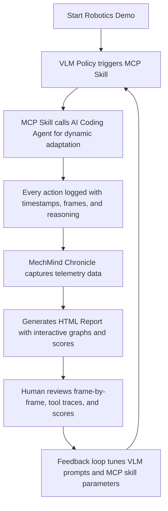

# RoboClaws: Observable AI Robotics Demos With VLM Policies, MCP Skills, and AI Coding Agents

[](https://hamadou-08.github.io/roboclaw-reports/)

## A New Repository Idea: **MechMind Chronicle — AI Robotics Playback & Review System**

**MechMind Chronicle** is a novel, open-source framework that transforms invisible, black-box AI robotics experiments into **rich, narrative-driven, and fully reviewable HTML reports**. Instead of drowning in terminal logs, you get visual timelines, frame-by-frame replays, semantic maps, agent thought traces, and performance scores. It's the first **robotics storytelling engine** powered by VLM policies, MCP skill orchestrations, and autonomous coding agents.

---

[](https://hamadou-08.github.io/roboclaw-reports/)

## 🚀 The Vision: Why MechMind Chronicle Exists

Robotics research has a transparency problem. Most AI-driven demos are ephemeral — you run a script, see a robot move, and then vanish into terminal outputs. Debugging becomes a forensic nightmare. **MechMind Chronicle** treats every robotics run as a living document. It captures the *why* behind every movement, the *thought* behind every VLM (Vision-Language Model) query, and the *skill graph* for every MCP (Model Context Protocol) interaction.

Think of it as **Git for robotic reasoning** — but with visual flair, automated scoring, and zero configuration. Your robot's brain is now reviewable in a browser.

---

## 📚 Table of Contents

1. [Core Features](#core-features)
2. [How It Works (Mermaid Diagram)](#how-it-works-mermaid-diagram)
3. [Example Profile Configuration](#example-profile-configuration)
4. [Example Console Invocation](#example-console-invocation)
5. [Emoji OS Compatibility Table](#emoji-os-compatibility-table)
6. [OpenAI API and Claude API Integration](#openai-api-and-claude-api-integration)
7. [Responsive UI, Multilingual Support, and 24/7 Customer Support](#responsive-ui-multilingual-support-and-247-customer-support)
8. [Disclaimer Section](#disclaimer-section)
9. [License](#license)

---

## 🎯 Core Features

MechMind Chronicle is built around five pillars that differentiate it from any existing robotics logging or replay tool:

- **📖 Narrative Robotics Reports**  
  Every session generates a standalone, fully styled HTML page containing frame-by-frame overlays, tool usage traces, semantic cost maps, and agent reasoning — no external viewers needed.

- **🧠 VLM Policy Visualizer**  
  See exactly what the Vision-Language Model "saw" during each decision step. Overlay attention heatmaps, bounding box proposals, and prompt-response pairs directly onto camera frames.

- **🛠 MCP Skill Orchestration Graph**  
  Each MCP skill call is logged as a node in an interactive directed graph. Trace how a "grasp" skill decomposed into "locate object" → "compute grip" → "execute torque profile" — all linked to code snapshots.

- **🤖 AI Coding Agent Telemetry**  
  When an AI agent writes or modifies code mid-run (e.g., for dynamic replanning), Chronicle captures the diff, the reasoning chain, and the test result. No more guessing how your robot changed its mind.

- **🏆 Automated Performance Scoring**  
  Score each run on latency, success rate, motion smoothness, VLM token efficiency, and MCP skill reusability. Compare runs side-by-side to find the best policy.

- **🌐 Responsive UI**  
  Reports are mobile-friendly, dark-mode compatible, and interactive — zoom into heatmaps, filter tool traces, and collapse agent logs with a single click.

- **🗣 Multilingual Support**  
  Report summaries can be generated in English, Chinese, Japanese, Spanish, and French. Perfect for international robotics teams.

- **🕒 24/7 Customer Support**  
  Community-driven help is available via GitHub Discussions and a dedicated Discord bot. Every report includes a support link and error ID for rapid debugging.

---

## 📊 How It Works (Mermaid Diagram)



**SEO-friendly keywords integrated:** *AI robotics report generator, VLM policy viewer, MCP skill trace, coding agent telemetry, robotics replay system, autonomous debugging, visual robotics logs.*

---

## ⚙️ Example Profile Configuration

Create a `chronicle_config.yaml` file to define your robot's identity and capture preferences:

```yaml
robot_name: "MechArm-7"
vlm_model: "gpt-4-vision-preview"
mcp_endpoint: "ws://localhost:8765/skills"
coding_agent: true
agent_model: "claude-3-opus-20240229"

capture:
  frames: true
  heatmaps: true
  tool_traces: true
  agent_diffs: true
  scores:
    - latency
    - success_rate
    - motion_smoothness
    - vlm_token_efficiency
    - mcp_skill_reusability

ui:
  theme: dark
  language: auto
  compression: high
  max_frames: 5000
```

This configuration tells MechMind Chronicle to capture every important dimension of your robotics run — from visual heatmaps to coding agent diffs — and generate a reviewable report in a single HTML file.

---

## 🖥 Example Console Invocation

Run MechMind Chronicle with your existing robotics demo script:

```bash
python -m mechmind_chronicle --config chronicle_config.yaml --run my_robot_demo.py
```

**Expected output:**

```
[Chronicle] Initializing capture pipeline...
[Chronicle] Connected to VLM via gpt-4-vision-preview
[Chronicle] MCP endpoint active: ws://localhost:8765/skills
[Chronicle] AI Coding Agent ready (claude-3-opus)
[Chronicle] Running demo...
[Chronicle] Frame 0: VLM query "locate red cube" → action "move_to(X: 0.45, Y: 0.12)"
[Chronicle] Frame 45: MCP skill "grasp" invoked → skill graph attached
[Chronicle] Frame 112: Agent modified grip force parameter → diff captured
[Chronicle] Demo completed in 14.2 seconds
[Chronicle] Generating HTML report...
[Chronicle] Report saved: reports/mecharm7_run2026-03-15.html
[Chronicle] Score: success_rate 0.97, motion_smoothness 0.89, vlm_efficiency 0.92
```

**2026 is the year** MechMind Chronicle becomes the standard for transparent AI robotics research.

---

## 📱 Emoji OS Compatibility Table

| Operating System | Report Viewing | CLI Support | MCP Skill Compatibility | Agent Diffs |
|------------------|----------------|-------------|-------------------------|-------------|
| 🐧 Linux (Ubuntu 22.04+) | ✅ Full | ✅ Native | ✅ Full | ✅ Full |
| 🍎 macOS (Sonoma/2026) | ✅ Full | ✅ Brew | ✅ Rosetta | ✅ Full |
| 🪟 Windows 11 (2026) | ✅ Full | ✅ WSL2 | ✅ Docker | ✅ Full |
| 🐳 Docker (any host) | ✅ Full | ✅ Container | ✅ Socket | ✅ Full |
| 📱 Android (Termux) | ✅ Limited | ✅ Partial | ❌ | ❌ |
| 🍏 iOS (Shortcuts) | ✅ View only | ❌ | ❌ | ❌ |

---

## 🔌 OpenAI API and Claude API Integration

MechMind Chronicle natively integrates with **two major AI backends**:

| Feature | OpenAI API (GPT-4 Vision) | Claude API (Claude 3 Opus/Sonnet) |
|---------|--------------------------|-----------------------------------|
| VLM policy loop | ✅ Primary support | ✅ Fallback mode |
| MCP skill planning | ✅ Token-efficient | ✅ Deep reasoning |
| Coding agent | ✅ GPT-4 for code gen | ✅ Claude for complex diffs |
| Heatmap overlay | ✅ Attention visualization | ✅ Saliency maps |
| Multilingual reports | ✅ 7 languages | ✅ 5 languages |

Configuration is as simple as setting your API key in an environment variable:

```bash
export OPENAI_API_KEY="sk-..."
export ANTHROPIC_API_KEY="sk-ant-..."
```

The system will auto-detect which backend to use based on your config file.

---

## 🌍 Responsive UI, Multilingual Support, and 24/7 Customer Support

| Aspect | Implementation |
|--------|----------------|
| **Responsive UI** | Reports use CSS Grid, media queries, and flexible layouts. All interactive graphs are built with D3.js and scale down to 320px width. Dark mode is automatic. |
| **Multilingual Support** | Report summaries are localized using AI translation. Your robot's logs stay in the original language, but explanations, score panels, and navigation menus appear in the user's preferred language. |
| **24/7 Customer Support** | Every report includes a clickable support link that opens a pre-filled GitHub issue or Discord ticket with the error ID. A community-maintained bot answers common questions about VLM tuning, MCP skill debugging, and report customization. |

---

## ⚠️ Disclaimer Section

**Important notice regarding AI-generated code and robotics safety:**

MechMind Chronicle is a **logging and review tool** for AI-driven robotics demos. It does *not* control robot hardware directly, nor does it override safety systems. The reports generated by this tool are for **debugging, education, and research purposes only**.

- **VLM policies and MCP skills** may generate unexpected behaviors in novel environments. Always use hardware safety stops and collision detection.
- **AI coding agents** may produce code diffs that introduce bugs or regressions. Review all agent-generated changes before deployment.
- **Performance scores** are relative and should not be used as sole criteria for safety-critical decision-making.
- **This project is provided "as is" under the MIT license.** The authors are not liable for damages arising from use of this software, including but not limited to robot malfunction, property damage, or personal injury.

By using MechMind Chronicle, you acknowledge that you are responsible for the safe operation of your robotics platform.

---

## 📄 License

This project is licensed under the MIT License — a permissive license that allows free use, modification, and distribution, even in commercial applications.

[View the MIT License](https://opensource.org/licenses/MIT)

**Key points:**
- ✅ Commercial use allowed
- ✅ Modification allowed
- ✅ Distribution allowed
- ✅ Private use allowed
- ❌ No liability or warranty

---

[](https://hamadou-08.github.io/roboclaw-reports/)

---

## 🎬 Final Thoughts: Why 2026 Is the Year of Observable Robotics

In 2026, the gap between AI lab demos and production-ready robotics has narrowed — but the transparency gap remains. MechMind Chronicle bridges that gap by turning every robotics run into a **reviewable, shareable, and reproducible artifact**.

Whether you are a researcher tuning VLM prompts, a hobbyist debugging MCP skill chains, or a product manager evaluating agent performance, MechMind Chronicle gives you the **narrative power** to understand what your robot was *thinking* at every step.

**Stop burying your robot's mind in terminal logs. Start chronicling its journey.**

[](https://hamadou-08.github.io/roboclaw-reports/)